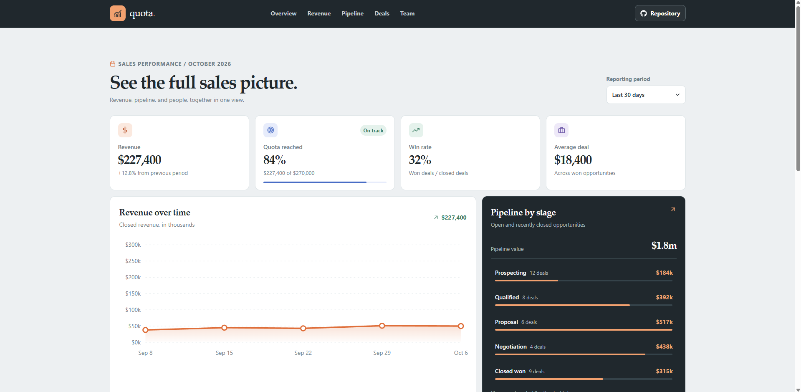

# Quota Sales Analytics Dashboard

Quota is a sales reporting workspace for reviewing revenue, quota progress, pipeline, recent deals, and sales team performance from one page. It uses sample records so the dashboard can be explored without a CRM account.

**Live dashboard:** [https://a2rp.github.io/sales-analytics-dashboard/](https://a2rp.github.io/sales-analytics-dashboard/)

## What is included

- A fixed header with links to Overview, Revenue, Pipeline, Deals, and Team. Each link scrolls to its section. The Repository link opens the public source repository.
- Three report periods: Last 30 days, Last quarter, and Year to date. The selection updates the revenue, quota progress, win rate, average deal, revenue chart, team results, and deal date range.
- Four summary metrics for total revenue, quota reached, win rate, and average deal size. The quota meter shows progress toward the period target.
- A revenue trend chart with period-specific points, currency labels, and a total for the selected period.
- A pipeline breakdown with the value and number of opportunities in each stage.
- A searchable deal register with company, contact, value, stage, owner, and update date.
- A leaderboard of the top three sales representatives with closed revenue and won deal counts for the selected period.
- A floating Back to top button that appears after scrolling more than 50 pixels.
- A responsive layout for desktop, tablet, and mobile widths.
- A footer with the project source, creator profile, portfolio, social, email, and support links.

## How to use the dashboard

Choose a reporting period near the page title. All summary values, the chart, team results, and deal date range update to match the choice. The sample reporting date is October 6, 2026.

The pipeline section lists Prospecting, Qualified, Proposal, Negotiation, and Closed won. Select a stage to filter the deals below. Select that stage again to clear the pipeline filter. The Deal stage selector in the deal register controls the same filter.

Use the deal search field to match a deal ID, company, contact, or owner. Search, stage, and reporting period filters apply together. Export CSV downloads the rows currently shown, including the active filters. The file contains the deal ID, company, contact, value, stage, owner, and date.

Click a section name in the fixed header to move through the report. When you have scrolled more than 50 pixels, use the arrow button at the lower right to return to the top.

## Data and limits

All report values and deal records are illustrative sample data kept in `src/data/sales.js`. The dashboard does not connect to a CRM, API, or server. It does not save edits or user data. The selected period, stage filter, and search text remain in the current page state and reset when the page reloads. CSV export creates a local download from the currently visible sample deals.

The date windows and sample figures use October 6, 2026 as the reporting date. Update the records and period ranges in the source data when adapting the dashboard to a different reporting date or a real sales system.

## Run locally

Install the dependencies and start the development server from the project folder:

```sh
npm install
npm run dev
```

Vite serves the app at `http://localhost:5173/sales-analytics-dashboard/` with the configured project base path.

## Lint and production build

```sh
npm run lint
npm run build
```

ESLint is the project's linter. The production output is written to `dist/` without source maps.

## Deployment

The project publishes through the `gh-pages` branch. Run:

```sh
npm run deploy
```

The `predeploy` script builds the app first, then `gh-pages` publishes `dist/`. The live site is [https://a2rp.github.io/sales-analytics-dashboard/](https://a2rp.github.io/sales-analytics-dashboard/).

## Future improvements

These are possible next steps and are not implemented in this project:

- Connect to a CRM API and refresh report data from a secure service.
- Add date range selection and custom reporting periods.
- Add charts for conversion rates, sales forecasts, and revenue by segment.
- Add role-based access, saved views, and shareable filtered reports.
- Add editable deal records and persistent storage.
- Add currency and locale settings for international sales teams.

## Links

- Portfolio: [https://www.ashishranjan.net](https://www.ashishranjan.net)
- GitHub: [https://github.com/a2rp](https://github.com/a2rp)
- CodePen: [https://codepen.io/ash1198](https://codepen.io/ash1198)
- LinkedIn: [https://www.linkedin.com/in/aashishranjan](https://www.linkedin.com/in/aashishranjan)
- Facebook: [https://www.facebook.com/theash.ashish/](https://www.facebook.com/theash.ashish/)
- YouTube: [https://www.youtube.com/@ashishranjan-ashz?sub_confirmation=1](https://www.youtube.com/@ashishranjan-ashz?sub_confirmation=1)
- Email: [mailto:ash.ranjan09@gmail.com](mailto:ash.ranjan09@gmail.com)

## Support

- Support: [https://a2rp-donation-page.netlify.app/](https://a2rp-donation-page.netlify.app/)
- Buy Me a Coffee: [https://buymeacoffee.com/ashishranjan](https://buymeacoffee.com/ashishranjan)
- Patreon: [https://www.patreon.com/ashishranjan](https://www.patreon.com/ashishranjan)
